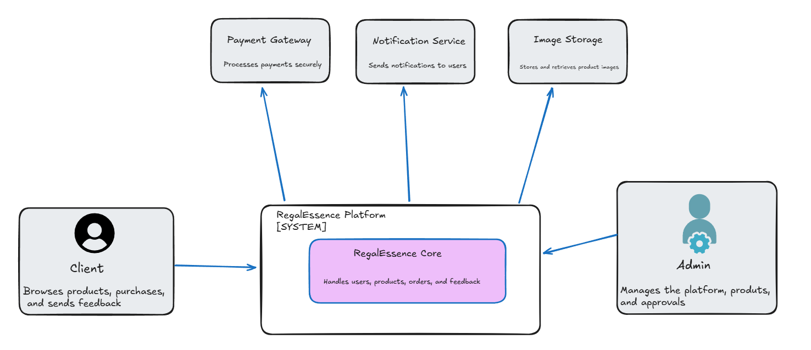
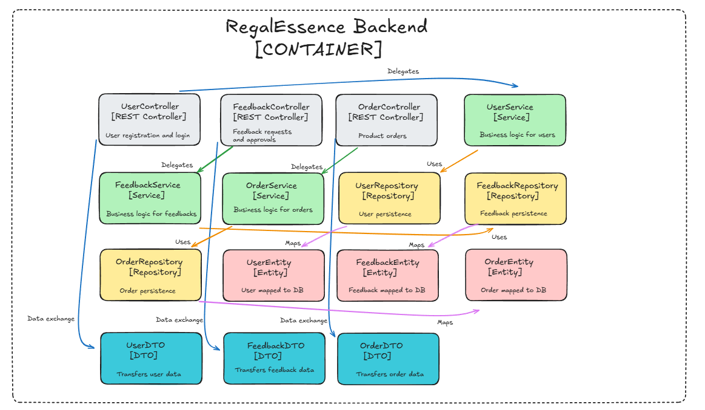
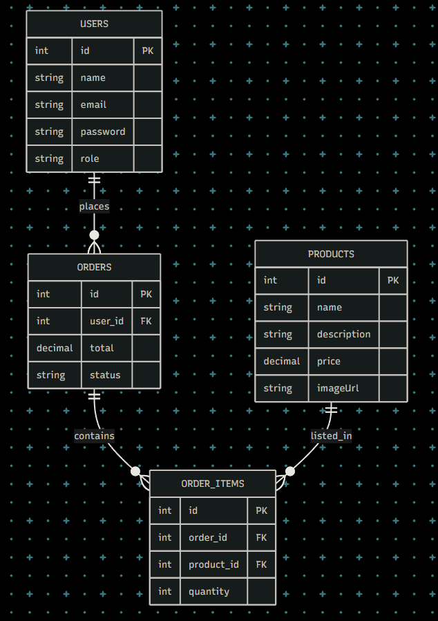
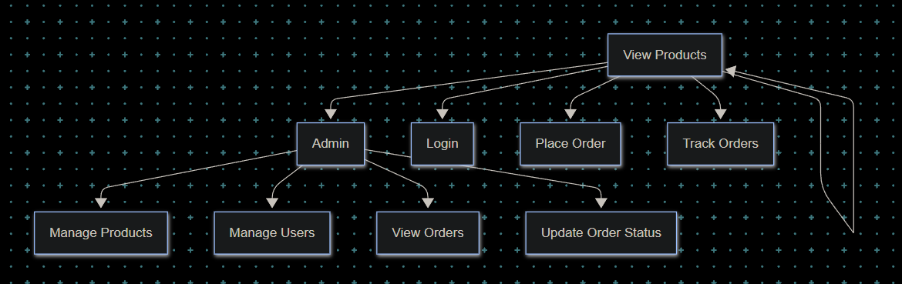

# RegalEssence 🎁✨

RegalEssence is a **fullstack e-commerce platform** focused on selling **premium and exclusive gifts** — from executive accessories (luxury pens, keychains, lighters) to unique birthday presents, both national and imported.  

The project aims to deliver an elegant online shopping experience with **luxury and refinement** at its core.  

---

## 🚀 Tech Stack

- **Frontend:** React + TypeScript  
- **Backend:** Java (Spring Boot)  
- **Database:** PostgreSQL  
- **Storage:** Local/S3 (for product images)  
- **Containerization:** Docker  
- **Deployment:** Production-ready (cloud/server)  

---

## 📂 1. Project Architecture

This diagram provides a **high-level overview of the entire system**, illustrating how different layers and components (frontend, backend, database, and external services) interact.  
It helps developers and stakeholders understand the **overall flow** of the application.

---

## ⚙️ 2. Backend Component Diagram

The component diagram breaks down the **backend’s internal structure**, showing controllers, services, repositories, and models.  
It highlights the **separation of concerns** and ensures a clean, maintainable architecture.

---

## 🗄️ 3. Database Schema (ERD)

The ERD (Entity-Relationship Diagram) models the **database schema**, defining entities (Users, Products, Orders, Order Items) and their relationships.  
It ensures data consistency and provides a clear reference for **backend and database design**. 

👥 4. Use Case Diagram (UML)

The use case diagram represents the main interactions between system actors (Client and Admin) and the platform.
It provides a functional view of the system, ensuring that both user needs and admin responsibilities are clearly defined.

